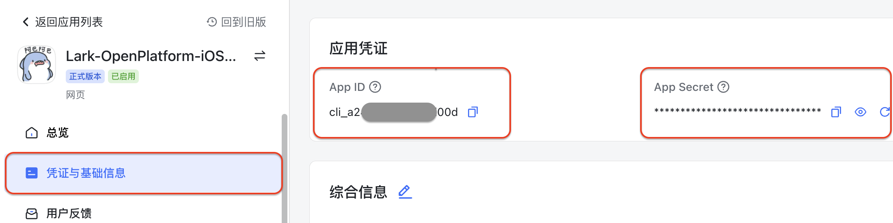
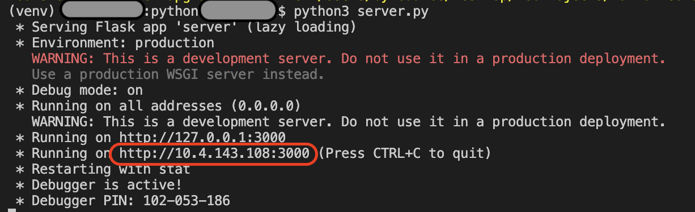
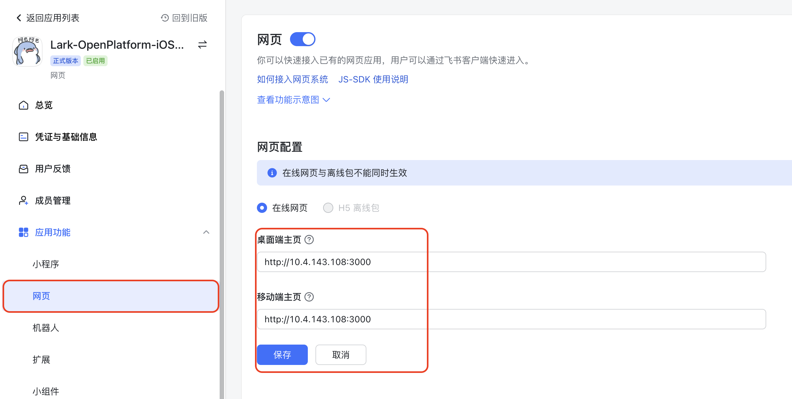
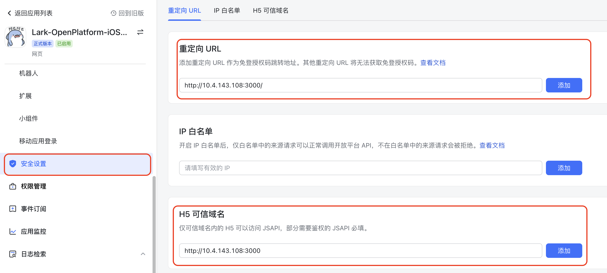
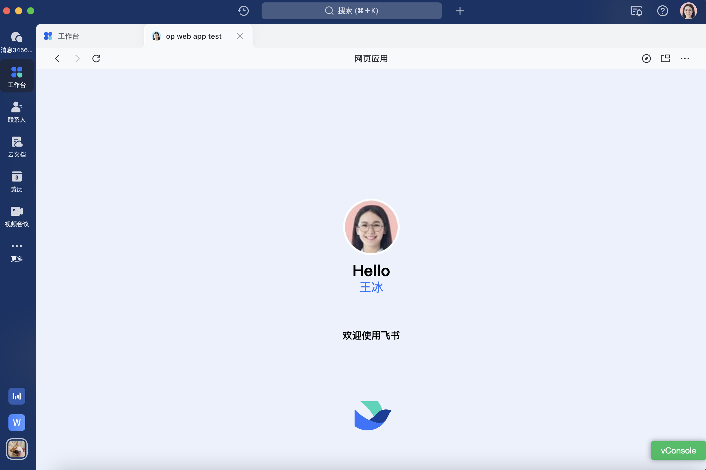

# 快速实现飞书客户端网页应用免登

## 1. 功能介绍
* 【免登】免登是指飞书用户在客户端内进入网页应用后，无需输入飞书用户名和密码，网页应用便可自动获取当前用户身份，进而登录系统的流程。
* 如果需要开发一款在飞书客户端内获取已登录飞书用户信息的网页应用，可以参考本示例。
* 本示例作为网页应用入门示例，介绍如何使用飞书开放平台提供的身份验证能力完成免登，并在服务端缓存方面提供了最佳实践。

## 2. 项目结构
> **public和templates**：前端模块，主要功能有：调取客户端API（JSAPI）获取免登临时授权码Code、展示免登用户信息、展示错误信息。
>
> **其他**：服务端模块，使用Flask构建，主要功能有：使用App ID和App Secret获取app_access_token、使用app_access_token和免登临时授权码Code获取user_access_token、使用user_access_token获取用户信息、处理错误信息、使用session存储用户信息等。

以下为目录结构与部分核心代码文件：

```
.
├── README.zh.md     ----- 说明文档
├── doc_images     ----- 说明文档的图片资源
├── public
│   ├── svg     ----- 前端图形文件
│   ├── index.css     ----- 前端展示样式
│   ├── index.js     ----- 前端主要交互代码（免登流程函数、用户信息展示函数）
├── templates
│   ├── err_info.html     ----- 前端错误信息展示页面
│   ├── index.html     ----- 前端用户信息展示页面
├── auth.py     ----- 服务端免登流程类、错误信息处理类
├── server.py     ----- 服务端核心业务代码
├── requirements.txt     ----- 环境配置文件
└── .env     ----- 全局默认配置文件，主要存储App ID和App Secret等
```
## 3. 运行前置条件

- 安装配置了[Python 3](https://www.python.org/)开发环境
- 安装配置了git工具

## 4. 准备工作

### 4.1 创建企业自建应用
在[开发者后台](https://open.feishu.cn/app/) 点击**创建企业自建应用**，创建成功之后，点击应用名称打开应用，点击**凭证与基础信息**切换页面，拿到 App ID 和 App Secret 信息。


### 4.2 下载代码
拉取最新代码到本地，并进入对应目录

```commandline
cd web_app_with_auth/python
```
## 5. 本地启动服务
### 5.1 修改环境变量

修改`.env`文件中应用凭证数据为真实数据。

```text
APP_ID=cli_9fxxxx00b
APP_SECRET=EX6xxxxOF
```
以上两个参数可以在[开发者后台](https://open.feishu.cn/app/) 点击**凭证与基础信息查看**。

**注意** 私有化部署时要修改`.env`文件中 FEISHU_HOST 为私有化部署所用的域名。
### 5.2 创建并激活虚拟环境
创建并激活一个新的虚拟环境

**mac/linux**

```commandline
python3 -m venv venv
. venv/bin/activate
```

**windows**

```commandline
python3 -m venv venv
venv\Scripts\activate
```

激活后，终端会显示虚拟环境的名称

```
(venv) **** python %
```

### 5.3 安装依赖

```commandline
pip install -r requirements.txt
```
### 5.4 启动项目并获取内网访问地址
运行服务端代码

```commandline
python3 server.py
```
启动后会生成临时域名，如下图所示，仅在同一局域网内有效。

## 6. 启动后配置工作
### 6.1 配置主页地址
点击**网页**切换页面，打开**启用网页**按钮，修改**网页配置**，**桌面端主页**和**移动端主页**都填写为5.4中获取的临时内网访问地址，比如此例中为`http://10.4.143.108:3000` 。


### 6.2 配置重定向URL和H5可信域名
点击**安全设置**切换页面，添加**重定向 URL**，配置重定向 url 白名单为5.4中获取的临时内网访问地址加斜杠，比如此例中为 `http://10.4.143.108:3000/` 。添加**H5可信域名**，配置H5可信域名为5.4中获取的临时内网访问地址，比如此例中为 `http://10.4.143.108:3000`.


**注意**：此处配置的重定向URL列表是该应用的重定向 url 白名单，重定向 URL 未配会在登录重定向时报错。

### 6.3 应用版本创建与发布
点击**版本管理与发布**，创建版本并发布上线

- 点击**创建版本**，填写发版必须内容，点击**保存**
  
  **注意**：仅可用性范围内用户能够打开应用。

- 点击**申请发布**，应用即时上线生效。

## 6. 飞书客户端内体验网页应用

手机端通过**飞书**>**工作台**> 搜索应用名称> 打开应用 便可体验Demo，并进行本地调试。移动客户端页面展示示例如下图所示。如正常运行，应当显示当前客户端内登录用户的姓名与头像。

**注意** 进行调试时手机和电脑需要在同一个局域网内。


**补充** 
* 手机端还可以通过扫描二维码（可借助[飞书开发者工具](https://open.feishu.cn/document/uYjL24iN/ucDOzYjL3gzM24yN4MjN)，由5.4中获取的临时内网访问地址生成）体验并调试Demo
* 桌面（PC）端也可以通过 **飞书**>**工作台**> 搜索应用名称> 打开应用 的方式体验Demo效果，应当如下图所示。


## 7. 参考文档
1. [应用免登概述](https://open.feishu.cn/document/uYjL24iN/ukTO4UjL5kDO14SO5gTN#6efde855)
2. [获取临时授权码Code](https://open.feishu.cn/document/uYjL24iN/uUzMuUzMuUzM/20220308)
3. [获取登陆用户身份](https://open.feishu.cn/document/uAjLw4CM/ukTMukTMukTM/reference/authen-v1/authen/access_token)
4. [网页应用调用JSAPI](https://open.feishu.cn/document/uYjL24iN/uITO4IjLykDOy4iM5gjM)

